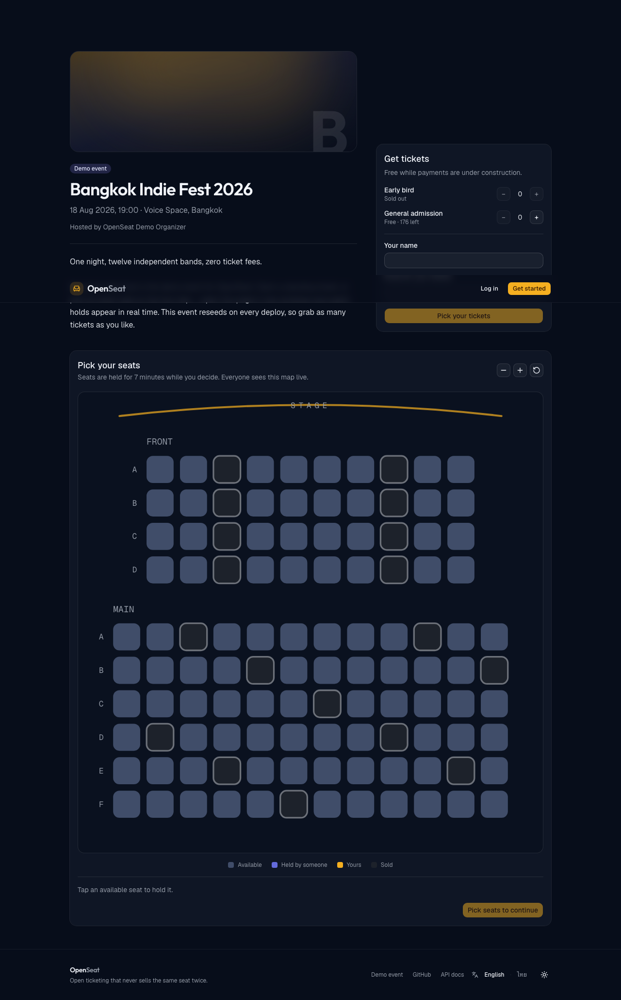
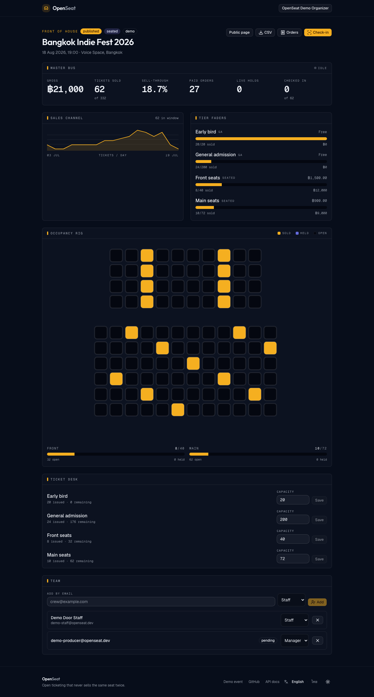
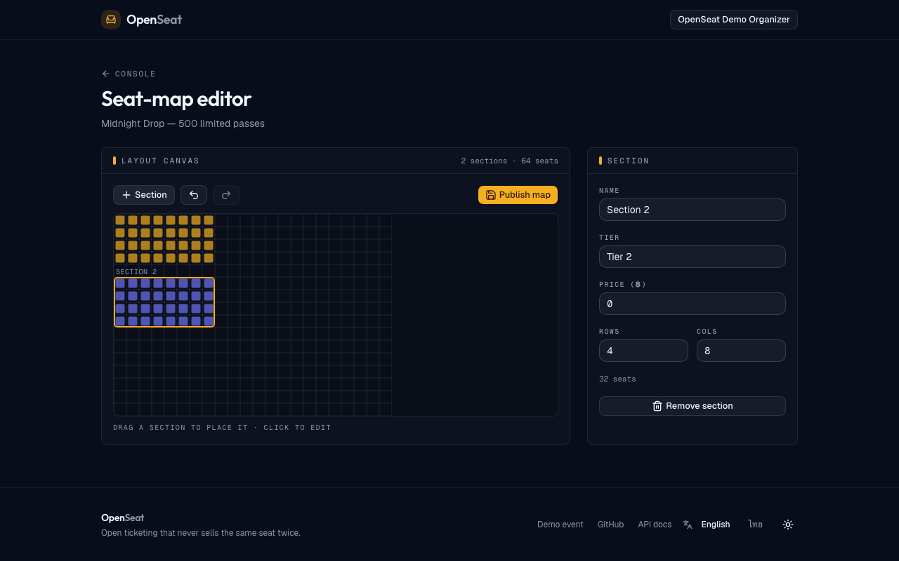
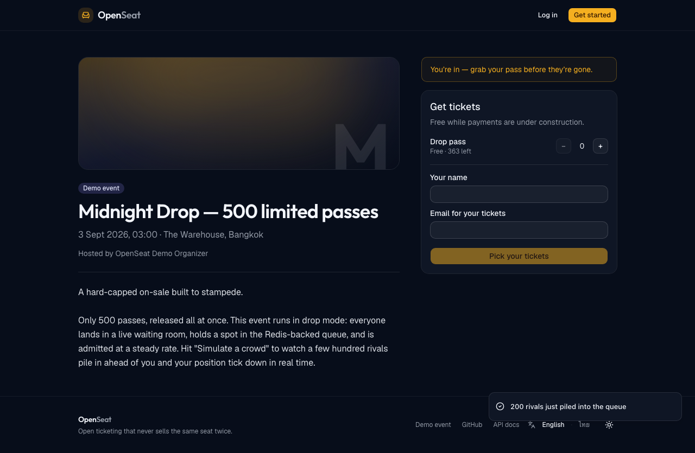
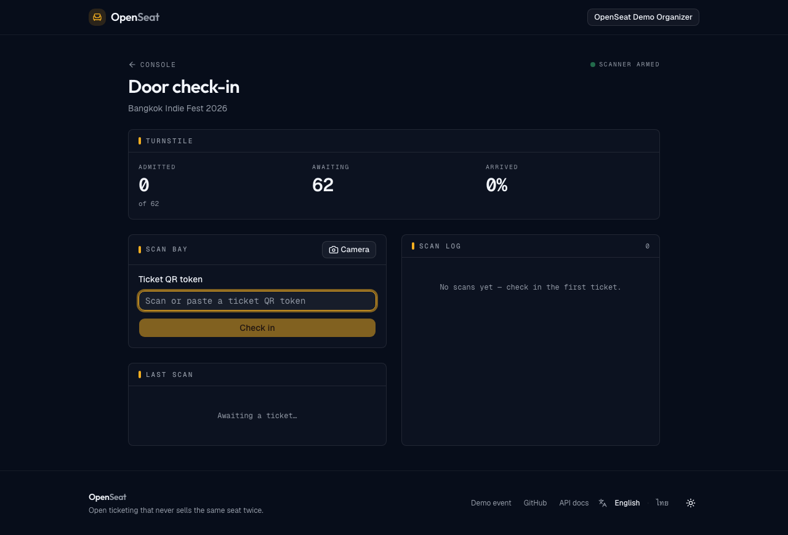
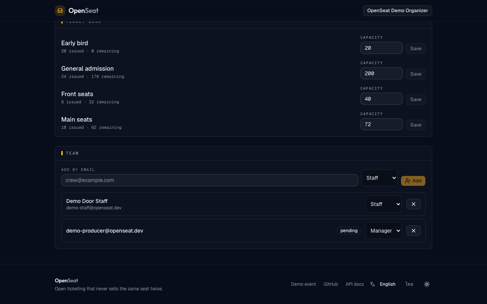

# OpenSeat

**Ticketing with real-time reserved seating.** Create an event, share the link, and let people pick their exact seat — while everyone else is picking theirs too.

[](https://github.com/nkieu-config/openseat/actions/workflows/ci.yml)
[](LICENSE)


**[Live demo](https://openseat-ticket.vercel.app)** · [API docs](https://openseat-api.onrender.com/api/docs) · [API health](https://openseat-api.onrender.com/api/health) · **[Read the code in ten minutes](docs/tour.md)**

Next.js · NestJS · Go · PostgreSQL · Redis — four services in one Turborepo, all of which come up locally with a single command. The demo needs no sign-up: the landing page signs you in as a buyer, an organizer, or door staff with one tap.

## Every seat, exactly once

That sentence is the entire engineering problem. Selling tickets is easy; selling *reserved* tickets is not, because inventory is contested, money is asynchronous, and demand arrives all at once:

- **Two people tap the same seat in the same instant.** Exactly one wins — and the loser has to find out immediately, on the map, not at checkout.
- **Payment settles out of band.** The provider confirms by webhook, which can arrive twice, arrive late, or never arrive. The seat can't be held forever, and it can't be sold twice while it waits.
- **On-sale is a thundering herd.** Ten thousand people refresh at 10:00:00. The database must not be what absorbs that.
- **The organizer is a user too.** Live sales, occupancy, refunds, door check-in, and a team whose permission boundaries are real.

OpenSeat is a portfolio project built like a product: each of those is solved with the boring, correct mechanism, and each has a test that proves it.

## Proof, not claims

- **No double-selling, proven twice over** — an API race test puts [50 buyers on one seat](apps/api/test/seats.e2e-spec.ts) and asserts a single winner; a [two-browser Playwright journey](tests/e2e/specs/seat-race.spec.ts) shows the loser's seat turn held, live, with no reload. GA inventory gets the same treatment with [100 concurrent buyers](apps/api/test/orders.e2e-spec.ts).
- **The surge is load-tested, not assumed** — the Go waiting room absorbed [~13,000 joins/second at p95 19.6ms with zero failed requests](docs/load-tests/gate-report.md) under k6.
- **One request, traced across two languages** — a browser fetch parents a span inside the Go gate over W3C traceparent ([the trace](docs/observability/trace-web-to-gate.png), [the dashboard](docs/observability/dashboard.png)).
- **The whole product runs in CI** — seven jobs on every push, covering lint, typecheck, unit and build, 80+ API integration tests against real Postgres and Redis, both Go suites under `-race`, 9 browser journeys, a dependency audit, and a smoke test that boots the built API image and probes it.
- **Every decision is written down** — 15 [ADRs](docs/adr), a spec and an implementation plan per milestone, and an [incident runbook](docs/runbook.md).

## Run it

Everything runs locally, including payments and email. Nothing needs an account or an API key.

**One command, no toolchain** — builds all four services as production images:

```bash
docker compose -f infra/docker-compose.full.yml up --build
```

Postgres, Redis, and Mailpit start first; a one-shot `migrate` service applies migrations and seeds the demo data; then the API, both Go services, and the web app come up behind health checks. Tear it down with `down -v`.

**Or the dev loop** — Node 22+, pnpm 11+, Go 1.26+, Docker:

```bash
docker compose -f infra/docker-compose.yml up -d
pnpm install
pnpm --filter api db:generate && pnpm --filter api db:migrate && pnpm --filter api db:seed
pnpm dev
```

Either way, the same five doors open:

| Service | Where |
|---|---|
| **Web** | <http://localhost:3000> — start here |
| **API** | <http://localhost:4000/api/docs> — Swagger |
| **PayMock** | <http://localhost:4100> — every paid checkout goes through it |
| **Gate** | <http://localhost:4200> — the drop event queues here |
| **Mailpit** | <http://localhost:8025> — ticket emails and QR codes land here |

> The web app has to get port 3000. `WEB_ORIGIN` is the API's CORS allowlist and the browser opens its realtime socket straight at the API origin, so if Next falls back to 3001 the pages still render while live seat updates silently stop. Free the port rather than accepting the fallback.

Quality gates, the same commands CI runs:

```bash
pnpm turbo run lint typecheck build test
pnpm --filter api test:e2e
pnpm e2e
```

## How a seat gets sold

Three independent layers, each one assuming the layer above it will eventually fail.

1. **Live state, so most collisions never happen.** Seat states are pushed over Socket.IO — batched every 250ms and fanned out through Redis — so a seat someone else is holding is already grey on your map before you reach for it.
2. **The database decides, inside a transaction.** A hold is `INSERT … ON CONFLICT DO NOTHING` against a unique `(event_id, seat_id)`; the loser gets a `409` in the same round trip. Holds carry a 7-minute TTL, an expired hold can be taken over inside that same transaction, and a BullMQ sweeper reclaims whatever slips through. GA inventory uses `UPDATE … SET remaining = remaining - n WHERE remaining >= n`.
3. **The schema makes the bug impossible.** Even if application logic were wrong, a partial unique index refuses the second row:

   ```sql
   CREATE UNIQUE INDEX tickets_event_seat_unique ON tickets (event_id, seat_id)
   WHERE seat_id IS NOT NULL AND status <> 'void';
   ```

   The `status <> 'void'` predicate is what lets a refunded seat go back on sale without ever loosening the guarantee. GA has the matching backstop: `CHECK (remaining >= 0)`.

Money is defended the same way. Orders are unique on `(event_id, idempotency_key)`, refunds on `(order_id, idempotency_key)` — so a system-issued compensation is structurally exactly-once, not merely carefully coded. Side effects that must not be lost (ticket emails, realtime pushes) are written to a transactional outbox in the same transaction as the state change, then claimed and dispatched. The reasoning is in [ADR 0002](docs/adr/0002-db-authoritative-holds.md), [ADR 0013](docs/adr/0013-money-path-compensation.md), and [ADR 0014](docs/adr/0014-webhook-handlers-are-idempotent.md).



## Architecture

Four runtime services and two datastores, in a Turborepo + pnpm monorepo.

| Component | Tech | Role |
|---|---|---|
| [`apps/web`](apps/web) | Next.js App Router, Tailwind, shadcn/ui | Public event pages (SSR), seat-map viewer and editor, checkout, organizer console |
| [`apps/api`](apps/api) | NestJS modular monolith | REST + OpenAPI, read-only GraphQL for the console, Socket.IO realtime, BullMQ workers, OpenTelemetry |
| [`services/paymock`](services/paymock) | Go | Simulated payment vendor: intents, hosted pay page, signed webhooks with retries and deliberate duplicates |
| [`services/gate`](services/gate) | Go | Waiting-room front door: Redis queue, SSE positions, stateless admission JWTs |
| Data | PostgreSQL 16 (Prisma 7), Redis 7 | Postgres is the single source of truth, outbox included; Redis does jobs, fanout, rate limits, and the queue |

A monolith, not microservices — [ADR 0001](docs/adr/0001-modular-monolith-first.md) records the seams where it would split and what would have to be true first. Everything ships as an image: 30 MB for PayMock, 44 MB for Gate, 406 MB for the web app, and 644 MB for the API — the last one on distroless, running as non-root with no shell in the image. [docs/aws-production.md](docs/aws-production.md) maps those same images onto ECS/RDS/ElastiCache with a cost estimate.

## Built by hand

The parts that would normally be a third-party widget or a vendor invoice — because those are the parts worth showing:

- **The seat map and its editor** — pan, zoom, hit-testing, live seat states, drag-and-drop layout with undo/redo, all in hand-written SVG. No seat-map library. [`seat-picker.tsx`](apps/web/src/app/events/[slug]/seat-picker.tsx), [`seat-map-viewport.ts`](apps/web/src/lib/seat-map-viewport.ts)
- **The payment vendor** — PayMock signs over the raw body, retries with backoff, injects failures, and double-sends every webhook on purpose so idempotency is exercised forever. [`webhook.go`](services/paymock/webhook.go), [`signer.go`](services/paymock/signer.go)
- **The waiting room** — a token-bucket admitter draining a Redis sorted set, minting a stateless admission JWT the API verifies by itself. [`admitter.go`](services/gate/admitter.go)
- **Authentication** — argon2 passwords, short access tokens with refresh rotation, Google ID-token sign-in, and guest checkout.
- **Authorization as data, not a token claim** — a three-rank ladder resolved from the database per request, so revoking a staffer takes effect on their very next call. [`access.service.ts`](apps/api/src/access/access.service.ts)

## What it looks like

The organizer's **Backstage Console** — live KPIs, a sales sparkline, per-tier price faders, and an occupancy heatmap painted onto the real floor plan:



<table>
<tr>
<td width="50%"><br><b>Seat-map editor</b> — drag-and-drop sections, rows, and seats, with undo/redo</td>
<td width="50%"><br><b>Waiting room</b> — live queue position over SSE, plus Simulate Crowd</td>
</tr>
<tr>
<td><br><b>Door scanner</b> — QR check-in, proven against concurrent double-scans</td>
<td><br><b>Event team</b> — owner, manager, and staff, with invitations pending registration</td>
</tr>
</table>

## How the work was run

Eleven milestones, each ending deployable. **Build** (M0–M6) shipped the product: reserved seating under concurrency, async payments, a waiting room, and the seat-map editor. **Harden** (M7–M10) turned a demo into a system: observability, browser end-to-end tests, refunds, and per-event RBAC. **M11** is the presentation pack you're reading.

Every milestone is a spec in [docs/specs](docs/specs) and a plan in [docs/plans](docs/plans); every decision with a tempting wrong answer is an [ADR](docs/adr). Commits are conventional. The domain language is fixed in [CONTEXT.md](CONTEXT.md) — a *hold* is a hold, money is integer satang, time is UTC — and the UI answers to [docs/design.md](docs/design.md).

Two full code reviews followed the roadmap. What they turned up was either fixed or — where the fix would have cost more than the defect — accepted on the record in an ADR. Where a fix was observable at runtime it was inverted first: break the fix, confirm the right test goes red, restore.

<details>
<summary><b>Milestone by milestone</b></summary>

<br>

| Milestone | Ships |
|---|---|
| **M0 — Foundation** | Turborepo monorepo, Docker Compose stack, CI, deploy skeleton, first ADRs |
| **M1 — Events & free tickets** | Auth with rotating refresh tokens + guest checkout, SSR event pages, atomic GA inventory (100-buyer race test), QR e-tickets by email, OpenAPI-generated client, demo mode |
| **M2 — Reserved seating** | Live seat map (hand-built SVG with pan/zoom), 7-minute holds with countdown and takeover, Socket.IO + Redis fanout, BullMQ hold sweeper, 50-buyer seat race, partial-unique DB backstop |
| **M3 — Payments** | PayMock in Go (signed, duplicated webhooks), `awaiting_payment` state machine with 15-minute expiry, transactional outbox, webhook dedup proven by e2e |
| **M4 — Organizer console** | "Backstage Console" design language, sales analytics + timeline, occupancy heatmap, attendee CSV export, read-only GraphQL ([ADR 0006](docs/adr/0006-graphql-read-only-dashboard.md)), QR check-in with concurrent double-scan proof |
| **M5 — Waiting room** | Go Gate service (Redis queue, SSE positions, token-bucket admitter), stateless admission JWTs ([ADR 0007](docs/adr/0007-waiting-room-gate.md)), k6 load report, Simulate Crowd |
| **M6 — Seat-map editor** | Drag-and-drop editor with undo/redo, EN/TH i18n on the landing and waiting-room flows, light-theme audit, [AWS production doc](docs/aws-production.md), [demo script](docs/demo-script.md) |
| **M7 — Observability** | OpenTelemetry traces/metrics/logs to Grafana Cloud, domain funnel dashboard, cross-language browser→Gate trace, 5xx alerting ([ADR 0009](docs/adr/0009-observability-otel-grafana-cloud.md)) |
| **M8 — Browser end-to-end** | Playwright journeys driving all four services, located by accessible role ([ADR 0010](docs/adr/0010-browser-tests-locate-by-role.md)) |
| **M9 — Refunds** | Organizer-triggered refunds that reclaim the seat live and settle on the provider's webhook ([ADR 0011](docs/adr/0011-refunds-reclaim-first.md)) |
| **M10 — Team RBAC** | Per-event owner/manager/staff read from the database, so revocation is instant ([ADR 0012](docs/adr/0012-event-team-rbac.md)) |
| **M11 — Presentation** | Captured media, this README, the [ten-minute tour](docs/tour.md), production Docker images |

</details>

**Deliberately out of scope**, and recorded as such: real-money processing, ticket resale, and native mobile apps. The payment provider is simulated on purpose — it is the only way to exercise retries, duplicates, and injected failures on every CI run.

## Where to look next

| Read this | If you want |
|---|---|
| [docs/tour.md](docs/tour.md) | The guided path — the pitch, the proof to open first, the code worth reading |
| [docs/adr](docs/adr) | 15 decisions — context, the call, the consequences, and for 13 of them the condition that would reverse it |
| [The design spec](docs/specs/2026-07-15-openseat-design.md) | Where the whole thing was argued out before any code |
| [CONTEXT.md](CONTEXT.md) | The project's ubiquitous language |
| [docs/runbook.md](docs/runbook.md) | What to do at 3am when Redis is gone |

MIT licensed. Built by [Natthachak](https://github.com/nkieu-config).
