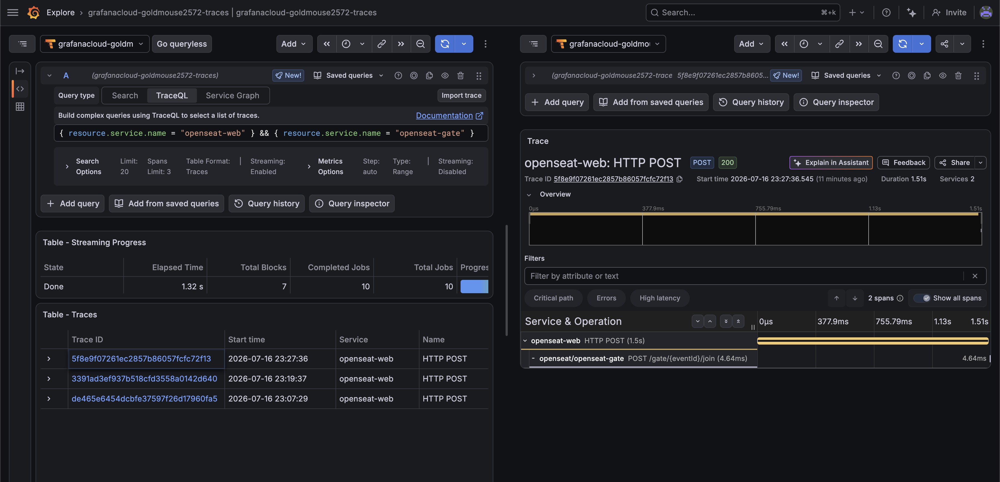

# Observability artifacts

The committed half of M7 (see `docs/specs/2026-07-16-m7-observability-design.md` and ADR 0009). Instrumentation exports OTLP directly to Grafana Cloud; these files let a reviewer read the operational surface without an account.

- [`openseat-ops-dashboard.json`](openseat-ops-dashboard.json) — the "OpenSeat Ops" dashboard model (RED · business funnel · drop ops).
- [`alert-rule.md`](alert-rule.md) — the single 5xx error-rate alert and how to prove it fires.
- `../runbook.md` — five incidents mapped to these panels and queries.

Proof it works in production:

-  — **`trace-web-to-gate.png`**: one trace, two languages. The browser's `fetch` span (`openseat-web`, JavaScript via Faro) is the parent of `POST /gate/{eventId}/join` (`openseat-gate`, Go). W3C `traceparent` survives the cross-origin hop, which is the whole point of instrumenting both sides with OpenTelemetry instead of a vendor SDK. Found with `{ resource.service.name = "openseat-web" } && { resource.service.name = "openseat-gate" }`.
- **`dashboard.png`** — the live dashboard with every row fed by real production traffic: RED across the API, the full funnel (10 holds won beside 4 lost to conflict → 1 order paid → 2 tickets checked in), `webhook_events_total` showing `processed 1` next to `duplicate 1` — PayMock's deliberate double-send meeting the `provider_event_id` dedup — and the queue draining from 509 to zero under the admitter's token bucket.
- **`alert-firing.png`** — the 5xx alert in its firing state.

## Import the dashboard

1. Grafana → **Dashboards → New → Import → Upload JSON file** → `openseat-ops-dashboard.json`.
2. Open the dashboard and set the **Metrics (Mimir)** dropdown at the top to the Grafana-Cloud Prometheus data source, then **Save**. A datasource variable imports with an empty selection; until it is set every panel queries nothing and the whole dashboard looks broken.
3. The custom-metric panels (funnel, drop ops) populate as soon as real traffic flows; the RED row needs the HTTP histogram (see the name note below).

## Metric catalog

Emitted OTel name → the counter/gauge/histogram it is, and where it is incremented. Counters already carry `_total`, so Prometheus normalization leaves them unchanged.

| OTel metric | Kind | Source | Labels |
|---|---|---|---|
| `holds_acquired_total` | counter | `holds.service.ts` acquire path | `result=won\|conflict` |
| `orders_paid_total` | counter | `payments.service.ts` on paid transaction commit | — |
| `tickets_checked_in_total` | counter | `checkin.service.ts` | `result=admitted\|duplicate` |
| `admissions_verified_total` | counter | `admission.guard.ts` | `result=valid\|rejected` |
| `webhook_events_total` | counter | `payments.service.ts` | `outcome=processed\|duplicate\|invalid` |
| `gate_joins_total` | counter | `queue.go` Join | — |
| `gate_admitted_total` | counter | `queue.go` Admit | — |
| `gate_sse_connections` | up/down counter (gauge) | `main.go` SSE handler | — |
| `gate_queue_depth` | observable gauge | `telemetry.go` callback (ZCard per event) | `event_id` |

HTTP server metrics come from `@opentelemetry/instrumentation-http` (v0.220, **old semconv by default**): histogram `http.server.duration` in **milliseconds**, with labels `http_method`, `http_status_code`, `http_route`, `service_name`. Grafana Cloud's OTLP ingest appends the unit suffix, so it lands in Mimir as **`http_server_duration_milliseconds_bucket` / `_count` / `_sum`** — confirmed in Explore on 2026-07-16 and used verbatim by the dashboard and the alert.

## Why the queries use a fixed `[5m]` window

`rate()` needs at least two samples inside its window. Both SDKs push metrics on an interval, so the window must comfortably exceed it — and Grafana's `$__rate_interval` does not know that interval (it derives from the *datasource's* scrape-interval setting, which OTLP push ignores). With the SDK default of 60s, `$__rate_interval` resolved to ~60s, every window held a single sample, and **every rate panel rendered empty while the metrics were plainly there in Explore**. A fixed `[5m]` is immune to that mismatch, so the dashboard works on import without anyone tuning the datasource.

The exporters push every **15s** (`exportIntervalMillis` in `apps/api/src/telemetry/tracing.ts`, `WithInterval` in `services/gate/telemetry.go`) rather than the 60s default: this product's interesting dynamics are second-scale — a waiting-room queue drains 250 entrants in ~30s — and 60s resolution flattens that curve into a couple of points.

## Why the funnel reads raw counters, not `increase()`

`increase()` extrapolates to the edges of its window. That is invisible at real traffic volumes but grossly wrong at demo volume: four holds rendered as `won 2.03 / conflict 3.04`, and a single admission rendered as `0`. Seat counts are integers — a funnel that shows 3.04 conflicts reads as broken, however defensible the maths. The funnel panels therefore read the counter directly (`sum by (result) (holds_acquired_total)`), which is exact. The trade-off: these totals accumulate from process start rather than following the time picker, and reset on deploy. At real volume, `increase()` would be the better choice.

Panels whose counter may never have been incremented (`orders_paid_total`, `tickets_checked_in_total`) append `or vector(0)`: an absent series renders as "No data", which looks like breakage when the honest answer is zero. The error-rate stat needs the same guard on its **numerator** — with no 5xx anywhere, `sum(rate(...{5xx}))` is an empty set and `empty / anything` is empty, so the panel showed "No data" until it was wrapped in `or vector(0)`.

## Known limitation: the waiting room's SSE stream is not traced

`joinQueue()` uses `fetch`, which Faro instruments — that is the span in `trace-web-to-gate.png`. The queue page then holds an `EventSource` (SSE) stream, and **OpenTelemetry's browser instrumentation does not patch `EventSource`**. So a visitor waiting in line produces one trace at join and nothing thereafter. The queue's behaviour during that wait is observable through the Gate's own metrics (`gate_queue_depth`, `gate_admitted_total`) instead. Tracing it would mean hand-rolling a span around the `EventSource` lifecycle — deliberately skipped: the metrics answer the operational question, and the trace would be a single long-lived span with no children.

## If the RED row is empty

First check the **Metrics (Mimir)** dropdown at the top of the dashboard is actually set — a datasource variable imports unselected, and every panel silently returns nothing until it is.

If the datasource is set and RED is still empty, re-confirm the metric names:

```promql
group by (__name__) ({__name__=~"http_server_.+"})
```

The name would only move if the app opted into stable HTTP semconv (`OTEL_SEMCONV_STABILITY_OPT_IN=http`), which renames it to `http_server_request_duration_seconds_*` and swaps the status label to `http_response_status_code`.

## Correlate logs ↔ traces

Every API log line carries `trace_id`/`span_id`. In **Explore → Loki**:

```logql
{service_name="openseat-api"} | json | level="error"
```

open a line, and the derived field links straight to the Tempo trace. Reverse direction: a slow or errored trace in Tempo shows its `service.name` and links back to its logs.
